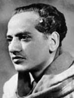

# Rendition by Hersh Bhasin
<iframe width="560" height="315" src="https://www.youtube.com/embed/QOe4AJnrrqg" frameborder="0" allow="accelerometer; autoplay; encrypted-media; gyroscope; picture-in-picture" allowfullscreen></iframe>
  

# Translation by Hersh Bhasin

We shall witness.

It's Imperative  that we too shall witness:    

that day promised to us till now,

that iron clad dictate writ in the lines of our brow.  

When these mountains of  tyranny, torment and unrest,

will dissipate like shreds of cotton in a tempest.

Under the feet of we the subjugated,

this earth will pulse and throb unabated.

And over the heads of these philosophers false,

lightening will crackle, snap and waltz.

When  in the land of the pure,

the  false idols are no more.

We the pure of heart, who the fundamentalists decry--

wlll take seats up high.

All crowns will be flung.

All thrones wrung.

Only His true name 

will remain.

Him:  who is both invisible, and yet visible;
Him: who is is both the beheld, and the beholder.

"I am Truth.. I am Truth": this thundering chant will roar

that is me, and  its you for sure.
And,  the pure hearted people will rule:

that is me, and  its you for sure.

# Hum Dekhenge (Hindi)

