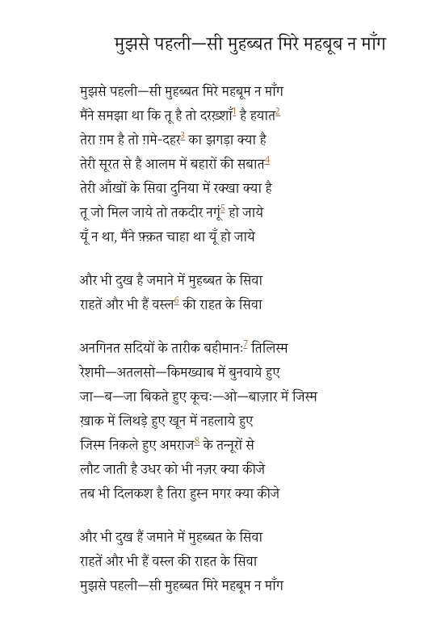

Faiz's poem, "Mujh Se Pehli Si Muhabbat".

<iframe width="560" height="315" src="https://www.youtube.com/embed/nPTlhLb75fk" frameborder="0" allow="accelerometer; autoplay; encrypted-media; gyroscope; picture-in-picture" allowfullscreen></iframe>

>Do not ask from me, my beloved, love like that former one.
>
> I had believed that you are, therefore life is shining;
>
>There is anguish over you, so what wrangle is there over the sorrow of the age?
>
>From your aspect springtimes on earth have permanence; 
>
>What does the world hold except your eyes?
>
>If you were to become mine. fate would be humbled.
>
>It was not so, I had only wished that it should be so.
>
> There are other sufferings of the time (world) besides love, There are other  pleasures besides the pleasures of union. 
>
>The dark beastly spell of countless centuries,
>
>Woven into silk and satin and brocade,
>
> Bodies sold everywhere in alley and market,
>
>Smeared with dust, washed in blood,
>
>Bodies that have emerged from the ovens of diseases,
>
>Pus flowing from rotten ulcers--
>
>My glance-comes back thatway too: what is to be done? 
>
>Your beauty is still charming, but what is to be done? 
>
>There are other sufferings of the time (world) besides love, 
>
>There are other pleasures besides the pleasures of union; 
>
>Do not ask from me, my beloved, love like that former one.
>
>*Translated by Victor Kiernan*

