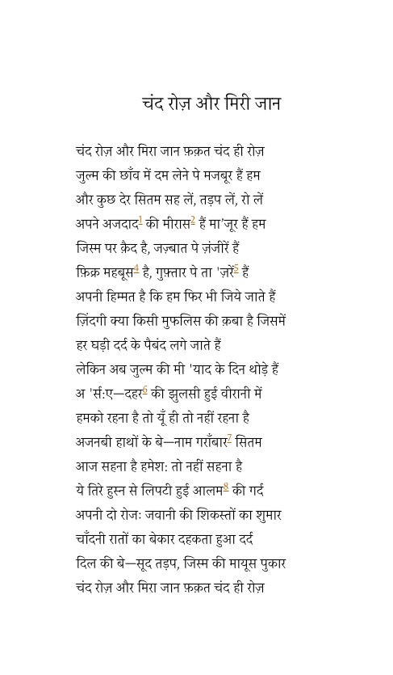

Faiz's poem, "Chand Roj Aur Mer Jaan":  A Few Days More, My Dear!

<iframe width="560" height="315" src="https://www.youtube.com/embed/LQzeAc9vick" frameborder="0" allow="accelerometer; autoplay; encrypted-media; gyroscope; picture-in-picture" allowfullscreen></iframe>

> A FEW DAYS MORE, MY DEAR!
>
> A few days more, my dear, only a few days.
>
> We are compelled to draw breath in the shadows of tyranny,· 
>
> For a while longer let us bear oppression, and quiver, and weep:
>
> It is our ancestors' legacy, we are blameless,·
>
> On our body is the fetter, on our feelings are chains,
>
> Our thoughts are captive, on our speech are censorings;
>
> It is our courage that even then we go on living.
>
> Is life some beggar's gown, on which
>
> Every hour patches of pain are fixed?
>
> But now the days of the span of tyranny are few;
>
> Patience one moment, for the days of complaining are few .
>
> *Victor Kiernan*

 

