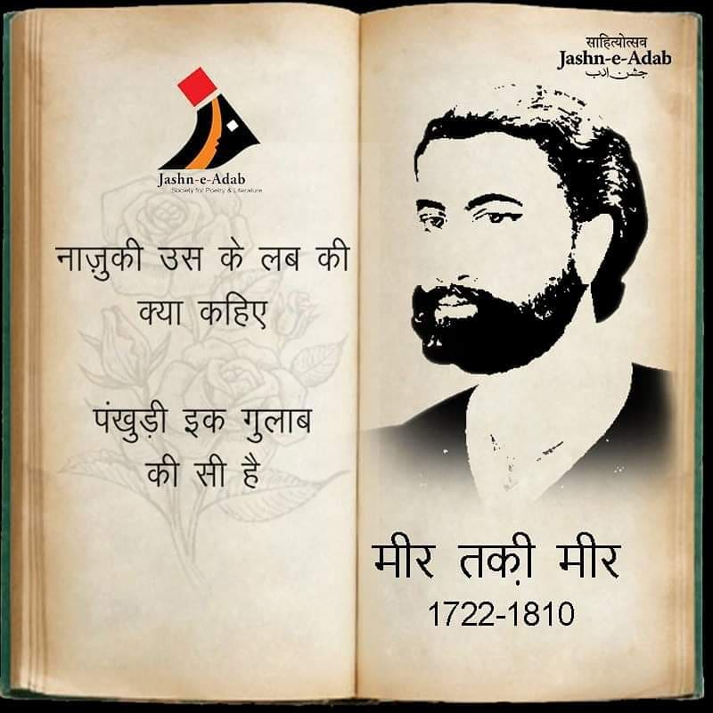



In an [interview](https://youtu.be/zoAh4khKSQA), the  poet Javed  Akthar talks about the problems of translating vernacular poetry into English. He says:

Poetry (shairi) talks  in a concise, summarized form (*iktisar* form). In this form, words have their own traditions. They are like people. When, say,  a stranger enters a room, you note his face, his features, his get up. Then, when you are introduced, you get to know that he is a doctor, and when you get talking to him, you realize that he studied at the same university as your elder brother etc. etc. -- thus you make new relationships with the stranger; then you slot him: what is his standing in society, what is his mental caliber, his intellect?

In the same way when you hear a new word for the first time, the first time it makes a contact with your ear, it is its sound that you hear. First, that sound produces an impression (*tasur*): its phonetic effect. The effect it produces, another word cannot produce. Second,  you understand the words meaning, its vocation. If the word is "apple", its job is to convey the meaning of apple. Third, you form associations with other words: what does this particular word remind me of? What other words has this particular word kept company with (its sangat)? What environment does it reside in (*maahol*)? With what other words have I used this word with? Because of this process, a environment, a breeze, a picture, a scene (*Fiza*) is created in your consciousness (*Zehen*).

Now, if you simply give out the meaning of a word: that this man is a doctor, and beyond that I do not know anything about this man. I cannot describe him, I don't know anything about his wholesome attributes (*Tarieef*) etc., you've not correctly described him. And this is the problem with translation from one language to another. Just giving the meaning of a word does not convey information about that words society, the company this word keeps with other words, with  words has this particular word galavanted with, what its environment (*maahol*) has been. An exact translation simply cannot be done.

Talking about specific problems of translation from Urdu to English, Javed says:

Each language has its distinct temperament. The syntax of English is meant for prose. This is because the suspense of each sentence (*jumla*) in English is revealed only in the last word. Whether you say, "How are <u>you</u>", or "I am going <u>home</u>", it's only in the last word that you will know what the speaker is saying.

Our vernacular languages are a bit laid back. Consider:

```
Main ghar jaa raha tha
```

Now in mid sentence, in "Ghar jaa ," the cat is already out of the bag. Or consider:

```
Tum kaisa ho?
```

In just saying "kaisa", you have let known your intention.

Now this looseness (*looch*) in our language works to our benefit when we write poetry in the vernacular. This is a uniqueness of our local tongues that is not available in other tongues. No one in the world can translate  Mir's line:

```
pañkhuḌī ik gulāb kī sī hai 
```

How can you translate "ki si"? (English translation would be: "like". How flat this is! )




Or take another line, from Firaq Gorakhpuri's poem:

```
Dil ko kayi kahaniya, yaad si aake reh gayi
```

One, the "si" is troublesome. Then we have "raha gayi" -- try translating these.

Here is the poem:

##Shaam bhi thi dhuan dhuan..

**by Firaq Gorakhpuri**

```
Shaam bhi thi dhuan dhuan
Husn bhi tha udaas udaas
Dil ko kayi kahaniya, yaad si aake reh gayi
```

> The evening was smokey, 
> her elegance was sorrowful
> Many forgotten stories were recollected by the heart

