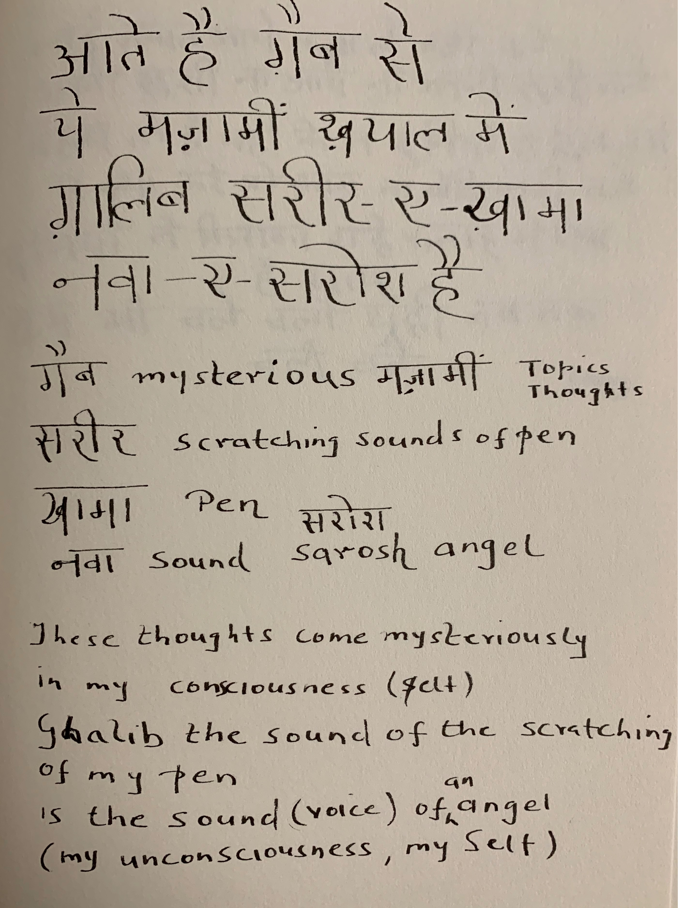

In an [discussion](https://youtu.be/PyVQQBXeXLk), the poet Javed Akthar and makes the following observations about the creative process:

When does creation happen? Not at the time of actual experience. When events are in your conscious mind, you can just report on them, not create a work of art. Your experience has to descend  into your consciousness. It has to simmer and melt and become like an exquisite  cusine where all ingredients, the spices, the masalas, become inseparable from the dish. Your experience: all that you saw, heard, smelt, has to go deep into your subconscious, and then peep out from your morality, from your ethics, and then, someday, you get the privilege, the competence  (*Kabil*) to write about it. Your experience has to seep into, then spread out into you consciousness (*zehen*), then come together in a new way in your awareness as a creation. What you experience today will take many years for you to be able to write about it. At that time, when you are able to write about it, you will wonder where these things you write about, come from. At that time, with Ghalib, you will say -- these thoughts come into my mind in mysterious ways:

But, Javed Akthar says, there is nothing mysterious (*Gaab*) about these thoughts. If these thoughts appeared mysteriously, one would  be able write in Chinese. No, these thoughts are result of the melting down of experience, which then come together to form a candle. Or like a piece of Bronze, which till it is a slab, it is useless. Only  when you melt the slab, can you put it into a mold and create a statute out of it. Your emotions, your observations, your spoken words, your thoughts ... all have to melt and then molded into a poem or a piece of prose.

