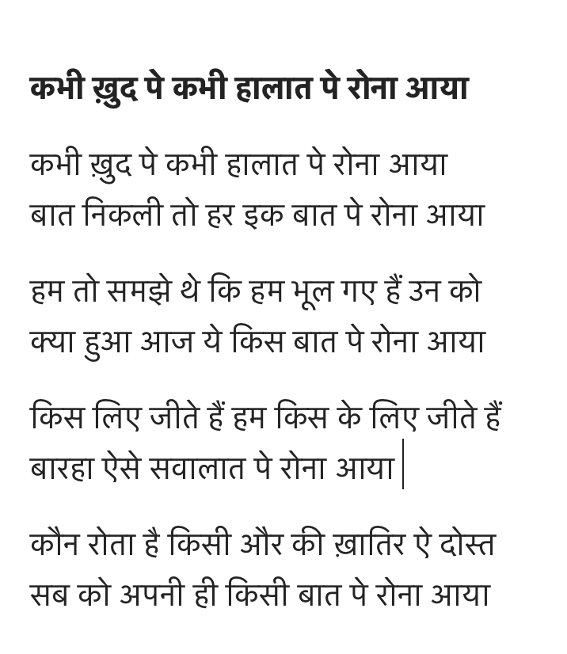

Sahir Ludhanvi's poem, ""Kabhī Khud Pe Kabhī Hālāt Pe Ronā Aayā" . I cry at myself, then at my fate...who cry's for another pain my friend...everyone cries on remembering their own pain.

<iframe width="560" height="315" src="https://www.youtube.com/embed/dpJ2-qz2yi0" frameborder="0" allow="accelerometer; autoplay; encrypted-media; gyroscope; picture-in-picture" allowfullscreen></iframe>

