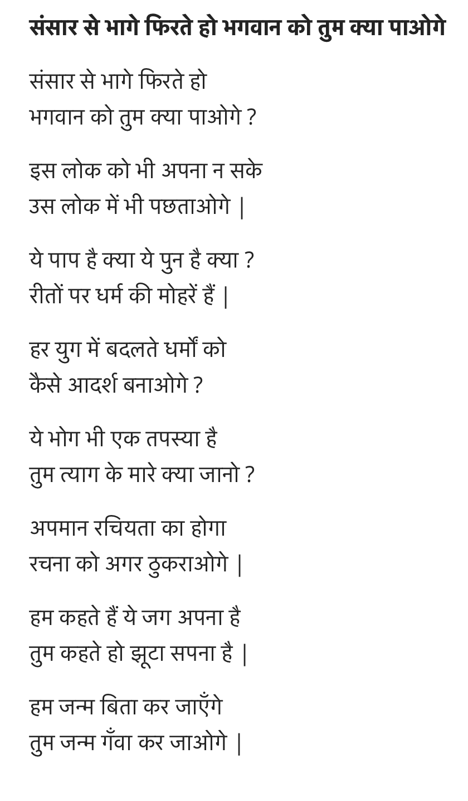

---

layout: post
title: "Sahir: You, who from the world seeks to flee"
author: "Hersh Bhasin"
comments: true
categories: Poetry Sahir-Ludhianvi
published: true
---

Sahir Ludhianvi's poem,  "Sansār Se Bhāge Phirte Ho Bhagvān Ko Tum Kyā Pāoge". In just a few lines Sahir expresses the shallowness of people who in lofty words declare that this world is false and they shall renounce the world and become ascetics. What is piety, and what is sin, he asks, but the stamp approval by a religion on  conventions; and in this sea of ever changing religions, what religion will you accept as your standard?

<iframe width="560" height="315" src="https://www.youtube.com/embed/7JcOtsNNjP8" frameborder="0" allow="accelerometer; autoplay; encrypted-media; gyroscope; picture-in-picture" allowfullscreen></iframe>

>   You, who from the world seeks to flee
>
>   Think in this way you will God see?
>
>This earthy world  you couldn't accept
>   
>That starry realm too will also disappoint, you'll see.
>   
>
>What is piety? and what is sin?
>   
>If not the stamp  on convention by a church.
>   
>From these ever changing churches
>   
>On which church's tune will you march?
>   
>I say this world belongs to us
>   
>You say this word is a false dream.
>   
>I will live my birth and leave
>   
>You will loose your birth and grieve.
>   
>*Translated by Hersh Bhasin*

